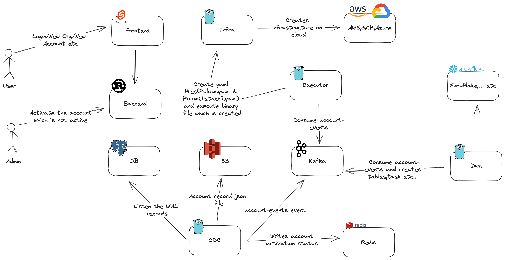

# dataseeker

### About

Dataseeker is used to create an infrastructure via **Pulumi** which is given cloud and dwh provider.
This project is specialized for gaming sector, but it can be use every kind of sector.

### Architecture

### Projects

You can find the projects below.

- [CDC](https://github.com/buzmar/pulumi-cdc)
- [DWH](https://github.com/buzmar/pulumi-dwh)
- [Executor](https://github.com/buzmar/pulumi-executor)
- [Infra](https://github.com/buzmar/pulumi-infra)
- [Backend](https://github.com/buzmar/pulumi-backend)
- [UI](https://github.com/buzmar/pulumi-ui)

### Todo

- Prepare the deployment for ks8
- UI improvements
- Backend improvements
- GCP,Azure infra implementation